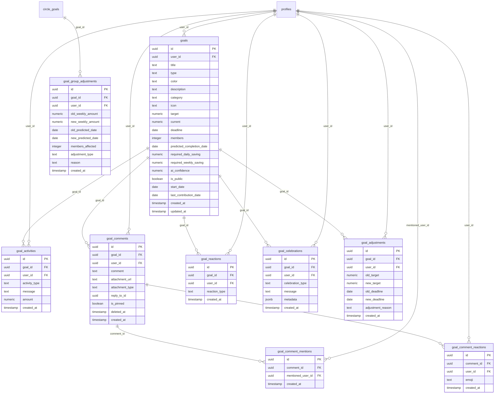
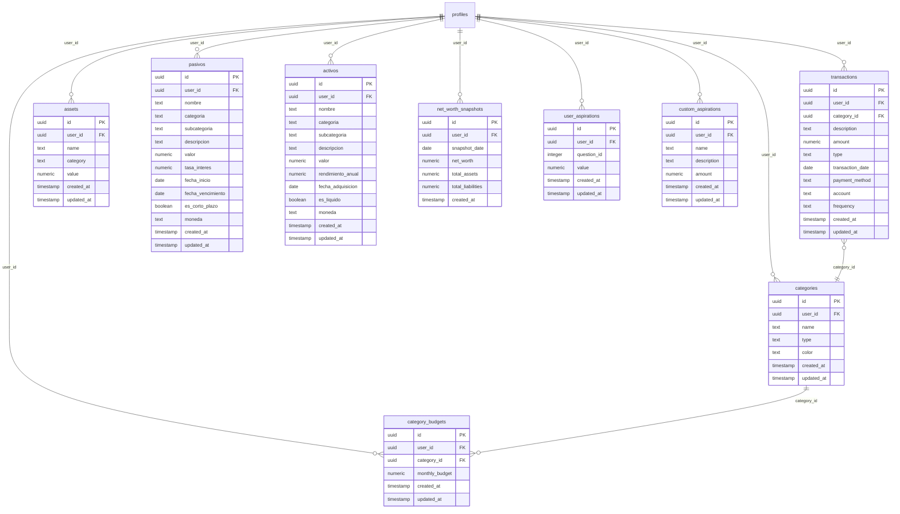

# MONI AI - Database Structure Documentation

Complete database schema documentation with detailed diagrams for all subsystems.

---

## 1. Social & Friendships System


---

## 2. Circles & Community System


---

## 3. Gamification System


---

## 4. Goals & Celebrations System



---

## 5. Core Financial System



---

## 6. Security & Banking System


---

## 7. Notifications & Communication System


---

## 8. Subscriptions & Referrals System


---

## 9. Competition Groups System


---

## 10. Additional Tables


---

## Quick Reference: Core User Profile


---

## View: Net Worth Summary

```sql
CREATE VIEW resumen_patrimonio AS
SELECT 
    user_id,
    total_activos,
    total_pasivos,
    (total_activos - total_pasivos) as patrimonio_neto
FROM ...
```

---

*Last updated: 2025*
*Generated from MONI AI database schema*
